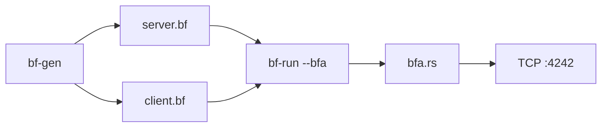

# bf-chat

EWOR builder case study — 1:1 chat in Brainfuck.

## Summary

Brainfuck has no networking. I extended it with **BFA** (Brainfuck + syscalls): in `--bfa` mode, `.` invokes a syscall using cells 0-7 as the call frame. Chat logic lives in `programs/server.bf` and `programs/client.bf`; Rust is the interpreter and TCP runtime. Programs are generated by `bf-gen` because hand-writing socket setup in brainfuck is impractical.

**Demo video:** [https://www.loom.com/share/63dab57b32194114a3fce4f6b3e79188](https://www.loom.com/share/63dab57b32194114a3fce4f6b3e79188)  
Silent walkthrough - two terminals, client sends first, host replies.

**Trade-offs:** blocking I/O, turn-based flow, localhost only (`127.0.0.1:4242`).

---

## Run locally

```bash
cargo build --release
make gen
```

**Terminal 1 — host**

```bash
make run-server
```

**Terminal 2 — client**

```bash
make run-client
```

### How to chat

1. On **client**, when you see `[client] type here>` , type a message and press **Enter**
2. On **server**, the message appears; at `[host] your reply>` , type a reply and press **Enter**
3. Reply shows on **client** - repeat

The server waits for the client to send first each round. Typing on the server before `[host] your reply>` does nothing useful.

---

## Architecture




| cells | role                         |
| ----- | ---------------------------- |
| 0     | syscall return               |
| 1–6   | arguments                    |
| 7     | syscall id                   |
| 8+    | fds, buffers, sockaddr bytes |


---

## Repository


| path                 | description                  |
| -------------------- | ---------------------------- |
| `programs/server.bf` | host - listen, accept, relay |
| `programs/client.bf` | client - connect, relay      |
| `src/bfa.rs`         | BFA interpreter + TCP        |
| `src/codegen.rs`     | emits `.bf` programs         |
| `DECISIONS.md`       | design choices               |
| `notes.md`           | implementation notes         |


### BFA syscalls


| id  | name    | args (cells 1–3) |
| --- | ------- | ---------------- |
| 1   | read    | fd, buf, max_len |
| 2   | write   | fd, buf, len     |
| 3   | close   | fd               |
| 10  | socket  | -                |
| 11  | bind    | fd, addr*, len   |
| 12  | listen  | fd, backlog      |
| 13  | accept  | fd               |
| 14  | connect | fd, addr*, len   |


sockaddr bytes are written to the tape; runtime uses `127.0.0.1:4242`.

Debug: `BF_TRACE=1 ./target/release/bf-run --bfa programs/server.bf`

### Tests

```bash
make test
```

CI runs on push via GitHub Actions.