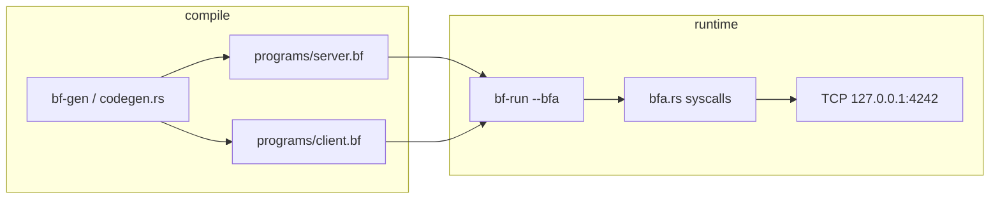

# bf-chat

EWOR builder case study — 1:1 chat in Brainfuck.

## TL;DR (for reviewers)

**Problem:** Brainfuck has 8 instructions and no way to open a TCP socket. The task asks for server + client 1:1 chat *in Brainfuck*.

**Approach:** I added **BFA** — brainfuck where `.` triggers a syscall instead of printing. Cells 0–7 are the call frame. A small Rust codegen emits `server.bf` / `client.bf` because socket setup by hand would be thousands of `+` signs.

**Demo:** two terminals, real TCP on `127.0.0.1:4242`. Logic lives in the `.bf` files; Rust is only the runtime.

**Trade-offs:** blocking I/O, client must type first each round, no TLS. Good enough to prove the idea.

**Video walkthrough:** *(paste your link here)*  
`https://`

---

## demo video

Record ~60 seconds: problem → `./target/release/bf-run --bfa` → two terminals chatting.

Put the link above when ready. Loom / QuickTime / whatever is fine.

---

## quick start

```bash
cargo build --release
make gen        # writes programs/server.bf + programs/client.bf
```

### Terminal 1 — host

```bash
make run-server
```

Wait for `peer connected — wait, client types first`.

### Terminal 2 — client

```bash
make run-client
```

When you see `[client] type here> ` — **type here first**, then **Enter**.

### chat flow (important)

This is turn-based, not WhatsApp.

1. **Client** types a line → Enter  
2. **Server** prints it, shows `[host] your reply>` → type → Enter  
3. **Client** prints the reply  
4. Repeat  

Do **not** type on the server until you see `[host] your reply>`. Typing before that is just terminal echo — the program is still waiting for the client.

Port: **4242** on localhost.

---

## architecture



Memory layout during a syscall:

| cells | role |
|-------|------|
| 0 | return value |
| 1–6 | args |
| 7 | syscall id |
| 8+ | program data (fds, buffers, sockaddr bytes) |

---

## repo layout

```
programs/server.bf   # host: listen, accept, relay
programs/client.bf   # client: connect, relay
src/bfa.rs           # BFA interpreter + TCP
src/codegen.rs       # .bf emitter
src/bf.rs            # plain brainfuck (no syscalls)
DECISIONS.md         # why I chose what I chose
notes.md             # dev log / bugs hit
SUBMISSION.md        # blurb for the EWOR form
```

---

## syscalls (BFA)

| id | name   | args (cells 1–3)        |
|----|--------|-------------------------|
| 1  | read   | fd, buf, max_len        |
| 2  | write  | fd, buf, len            |
| 3  | close  | fd                      |
| 10 | socket | —                       |
| 11 | bind   | fd, addr*, len          |
| 12 | listen | fd, backlog             |
| 13 | accept | fd                      |
| 14 | connect| fd, addr*, len           |

\*sockaddr bytes are written to the tape; runtime binds `127.0.0.1:4242` directly (macOS struct layout was not worth fighting in v1).

Debug: `BF_TRACE=1 ./target/release/bf-run --bfa programs/server.bf`

---

## tests & CI

```bash
make test
```

GitHub Actions runs the same on push.

---

## further reading

- `DECISIONS.md` — design choices  
- `notes.md` — bugs and rabbit holes  
- `SUBMISSION.md` — copy-paste for the form
